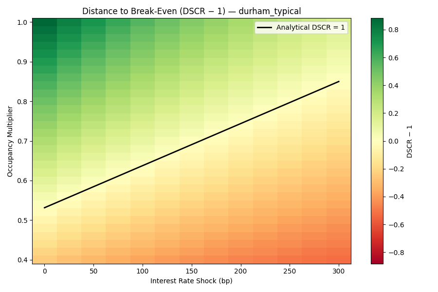
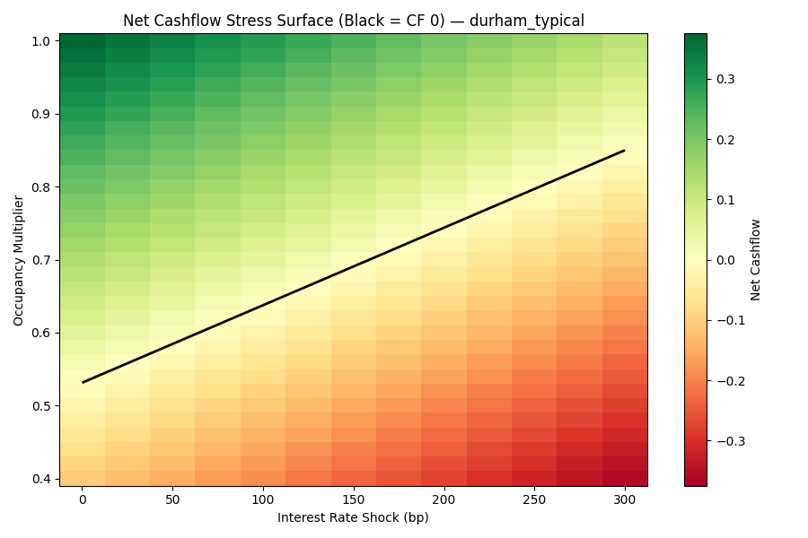

# Cashflow Stress Testing Under Rate and Vacancy Shocks


<p align="center">
  
</p>

## Research Question
Where and how does a **levered UK rental cashflow** become infeasible under adverse:
- **interest-rate shocks** (parallel shifts), and
- **revenue interruption** via **vacancy/occupancy regimes**?

This repo is **stress testing**, not forecasting: it identifies **failure regions** and **break-even boundaries**.

## Motivation (risk lens)
Levered cashflow assets can fail nonlinearly: small rises in funding costs or short void periods can push cashflow below debt service. Stress testing is a transparent way to answer:

- “How much headroom do I have?”
- “What combinations of rates and occupancy break the structure?”
- “How sensitive is feasibility to leverage (via a single calibration scalar)?”

## Model (deterministic, one-year)
All quantities are annual and deterministic over a one-year window.

**Inputs**
- `occ ∈ [0,1]`: occupancy multiplier (fraction of gross rent realised over the year)
- `c`: operating cost ratio (fraction of realised rent)
- `r`: interest rate (decimal)
- `R`: gross annual rent (normalised to 1.0 in the model)
- `D`: outstanding debt balance (interest-only)

**Cashflow definition**
- Revenue: `rev = R · occ`
- Operating costs: `opex = c · rev`
- Net operating income: `NOI = rev − opex = (1−c) · R · occ`
- Interest-only debt service: `int = r · D`
- Net cashflow: `CF = NOI − int`
- DSCR: `DSCR = NOI / int` (defined as 0 when `occ=0`)

**Failure rule**
A scenario is infeasible without external support if:
- `CF < 0` **or** `DSCR < 1`.

> Under this simplified model (proportional opex, interest-only, no fixed costs), the boundaries `CF = 0` and `DSCR = 1` coincide. See `notes.md` for the derivation and when this stops being true.

## Assumptions and exclusions (by design)
Assumptions are frozen in `data/assumptions.yaml`. This repo **explicitly excludes**:
- house price dynamics / appreciation
- rent forecasting, inflation modelling, macro prediction
- taxes, amortisation schedules, behavioural assumptions
- optimisation / “best deal” selection

The point is to map **downside feasibility**, not expected returns.

## Structural vs calibrated runs
The model is intentionally **scale-free**. Asset specifics enter through a single calibration scalar:

\[
\theta = \frac{\text{annual rent}}{\text{outstanding debt}} = \frac{R}{D}
\]

Equivalently, using a heuristic mapping:
\[
\theta \approx \frac{\text{gross yield}}{\text{LTV}}
\]

This repo supports three calibration presets (in `assumptions.yaml`):

- `structural_normalised`: dimensionless sanity check (`θ = 1`)
- `durham_typical`: transferable heuristic (e.g. gross yield + LTV → implied `θ`)
- `rightmove_example`: worked example from one listing (frozen `rent` and `debt` → implied `θ`)

Structural mode is for **sanity-check geometry** (monotonicity, analytic boundary agreement). Calibrated modes are what you use for **realistic interpretation**.

## Stress grid
The stress grid is defined in YAML:
- interest-rate shocks: `rate_shock_bp` over a deterministic range
- occupancy multipliers: `occ` over a deterministic range

(If a structural preset uses a lower occupancy range than “realistic” presets, it may optionally override the occupancy grid.)

## Outputs
Running the scripts produces:
- `results/stress_results__<preset>.csv` (scenario table)
- `results/dscr_gap_surface__<preset>.png` (DSCR − 1 surface, white = break-even)
- `results/net_cashflow_surface__<preset>.png` (CF surface, black contour = CF = 0)

Re-running the same preset overwrites its own files (by design). Different presets do **not** overwrite each other because filenames include the preset name.

## Results
Below are the two core figures for preset: `durham_typical`.

**Distance to break-even (DSCR − 1) under rate × occupancy shocks**


**Net cashflow under the same stress grid (black contour = CF = 0)**


## Interpretation (how to read the plots)
- **Green**: feasible (DSCR > 1 and CF > 0)
- **White boundary**: break-even line (DSCR = 1 / CF = 0)
- **Red**: infeasible (cashflow shortfall / coverage breach)

Use these figures to **reject fragile structures** (too little headroom, too steep sensitivity), not to “pick the highest return”.

## Reproducibility
Install dependencies:
```bash
python -m pip install -r requirements.txt
```

Run the default preset (from YAML):
```bash
python src/simulate.py
python src/plots.py
```

Choose a preset explicitly:
```bash
python src/simulate.py --preset durham_typical
python src/plots.py --preset durham_typical

python src/simulate.py --preset rightmove_example
python src/plots.py --preset rightmove_example
```

Override base interest rate (optional, decimal):
```bash
python src/plots.py --preset durham_typical --base-rate 0.045
```

## Limitations
- Occupancy is a single-year multiplier (doesn’t capture seasonality or re-letting frictions)
- Opex is proportional to realised rent (no fixed annual costs). This implies at `occ=0` the model has `opex=0`, but **interest still accrues**, so cashflow remains negative.
- Under this proportional-opex model, DSCR and net cashflow share the same break-even boundary.
- Interest shocks are parallel shifts (no term structure, no refinancing spreads)
- One-year horizon only (no long-run dynamics)

See `notes.md` for deeper caveats and what to change if you want DSCR and CF to diverge.
